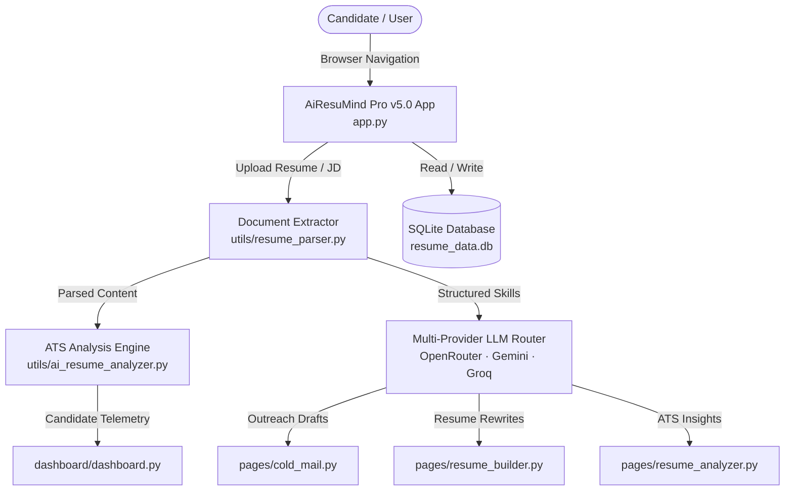

<div align="center">

# AiResuMind Pro v5.0

**AI Career Intelligence Platform — Build better applications. Make smarter career decisions.**

[](https://python.org)
[](https://streamlit.io)
[](LICENSE)
[]()
[]()

*Know how your resume performs. Find the gaps before recruiters do.*

</div>

---

## Overview

**AiResuMind Pro v5.0** is an executive-grade AI career intelligence operating system. Built with an Apple and Linear-inspired dark glassmorphic interface, it connects resume parsing, ATS benchmarking, job discovery, role optimization, and recruiter outreach into a unified workflow.

---

## Table of Contents

- [Core Principles](#core-principles)
- [Platform Modules](#platform-modules)
- [Design System](#design-system)
- [Architecture](#architecture)
- [Tech Stack](#tech-stack)
- [Project Structure](#project-structure)
- [Prerequisites](#prerequisites)
- [Setup](#setup)
- [Environment Variables](#environment-variables)
- [Running the Project](#running-the-project)
- [License](#license)

---

## Core Principles

1. **Zero Fabrication**: No fake statistics or filler data. All metrics represent verified candidate telemetry.
2. **Editorial Aesthetics**: Stark dark canvas (`#0B0C0F`), high-contrast SF Pro / Inter typography, and generous negative space. Zero emojis.
3. **Structured AI Responses**: Observational insight model (`OBSERVATION` → `WHY IT MATTERS` → `RECOMMENDATION` → `ACTION`).

---

## Platform Modules

- **AI Career Command Center** — Centralized dashboard for application readiness, score telemetry, and prioritized career recommendations.
- **Resume Intelligence & Analyzer** — Benchmarks documents against 50+ ATS screening criteria, producing keyword gap matrices and before/after bullet rewrites.
- **Resume Builder Workspace** — Step-by-step optimization flow (`01 Resume` → `02 Target Role` → `03 Optimize` → `04 Generate`).
- **Outreach Intelligence (Cold Mail)** — Tailored recruiter cold emails and LinkedIn outreach messages with personalization scoring.
- **Job Discovery Engine** — High-precision job search with AI match scoring and strengths vs. gaps breakdown.

---

## Design System

| Token | Value | Description |
|---|---|---|
| `--bg` | `#0B0C0F` | Main dark background canvas |
| `--surface` | `#141519` | Structural panel container |
| `--surface-elevated` | `#191A1F` | Callout and highlight cards |
| `--text-primary` | `#F5F5F7` | Primary high-contrast text |
| `--text-secondary` | `#86868B` | Secondary editorial copy |
| `--border` | `rgba(255, 255, 255, 0.08)` | Low-contrast glass border |

---

## Architecture



---

## Setup & Execution

```bash
# Clone & enter directory
git clone https://github.com/princekjha-dev/AiResuMind.git
cd AiResuMind

# Activate virtual environment
source .venv/bin/activate

# Run AiResuMind Pro v5.0
streamlit run app.py
```

Available at **http://localhost:8501**.

---

## License

This project is licensed under the [MIT License](LICENSE).
