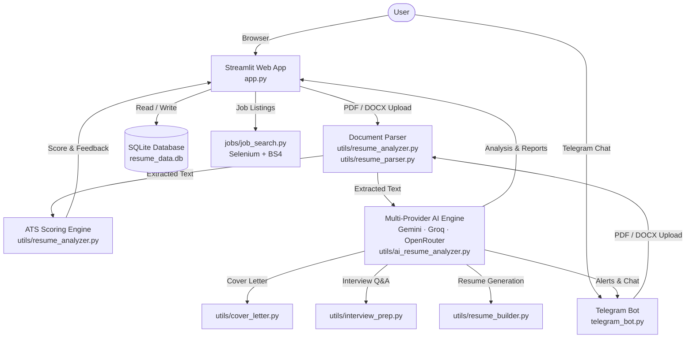

<div align="center">

# AiResuMind

**AI-powered resume intelligence, ATS optimization, and career development platform.**

[](https://python.org)
[](https://streamlit.io)
[](LICENSE)
[]()
[]()

*Parse. Score. Optimize. Interview. Land the offer.*

</div>

---

## Overview

**AiResuMind** is a full-stack AI career intelligence platform that takes a raw resume (PDF or DOCX) and transforms it into a comprehensive candidate profile — complete with ATS compatibility scoring, keyword gap detection, AI-generated cover letters, mock interview preparation, and a real-time job search engine.

It runs as a **Streamlit web application** and optionally as a **Telegram bot**, both powered by a multi-provider LLM backend (OpenRouter, Gemini, Groq) with automatic fallback across providers.

---

## Table of Contents

- [Features](#features)
- [Architecture](#architecture)
- [Tech Stack](#tech-stack)
- [Project Structure](#project-structure)
- [Prerequisites](#prerequisites)
- [Setup](#setup)
- [Environment Variables](#environment-variables)
- [Running the Project](#running-the-project)
- [Telegram Bot Commands](#telegram-bot-commands)
- [Community & Security](#community--security)
- [License](#license)

---

## Features

### Resume Analysis & ATS Scoring
- **ATS Compatibility Score** — Evaluates resumes against 50+ automated screening criteria including keyword density, formatting hierarchy, section completeness, and quantified achievement density.
- **Keyword & Skills Gap Detection** — Identifies missing high-impact keywords by comparing against target job descriptions and role-specific industry benchmarks.
- **Multi-Provider AI Fallback** — Seamlessly transitions across OpenRouter (Claude 3.5 Sonnet / Kimi K3), Gemini 1.5 Pro, and Groq API. If one provider is rate-limited or unavailable, the next is used automatically.
- **Brutal Roast Mode** — Opt-in blunt critique that flags weak bullet points, filler language, and missing quantification with direct fix suggestions.
- **PDF, DOCX & TXT Parsing** — Reliable multi-format extraction via `pdfplumber`, `PyPDF2`, and `python-docx`.

### Career Development Suite
- **AI Cover Letter Generator** — Creates tailored, job-specific cover letters with tone presets (Professional, Executive, Concise, Creative) and exports to `.txt`.
- **AI Mock Interview Prep** — Generates behavioral, technical, and system design questions with STAR-method answer frameworks for SDE, AI/ML, Data Analyst, Product, and DevOps roles.
- **Prompt-Based Resume Builder** — Provide a target job description; AI auto-generates a structured, ATS-optimized resume. Four export templates: Modern, Minimal, Professional, Creative — with native `.docx` output.
- **LinkedIn Job Search Engine** — Real-time scraping of LinkedIn, Indeed, and Naukri job boards with AI-computed candidate match percentages.

### Dashboard & Analytics
- **Executive Career Telemetry** — Tracks ATS score progression, keyword lift metrics, and recruiter callback rate estimates across resume iterations.
- **Resume History & Comparison** — SQLite-backed storage of all uploaded resumes and analysis results with Excel export.

### Telegram Bot
- Accepts PDF and DOCX uploads directly in Telegram chat.
- `/roast` — Instant, no-filler critique of an uploaded resume.
- `/jobs [keyword]` — Real-time job listing search via chat.
- Supports interactive AI Q&A over the candidate's uploaded document.

---

## Architecture



---

## Tech Stack

| Layer | Technology |
|---|---|
| **Web Framework** | Streamlit |
| **Styling** | Vanilla CSS, custom design system |
| **Backend Language** | Python 3.10+ |
| **AI Providers** | OpenRouter (Claude 3.5 Sonnet, Kimi K3), Gemini 1.5 Pro, Groq (Llama 3) |
| **Telegram Integration** | `python-telegram-bot` ≥ 20.0 |
| **Database** | SQLite 3 via SQLAlchemy |
| **Document Processing** | PyPDF2, pdfplumber, python-docx, docx2txt, pdf2image |
| **Job Scraping** | Selenium, BeautifulSoup4, webdriver-manager |
| **Data & Analytics** | Pandas, Plotly, NumPy, scikit-learn |
| **NLP** | spaCy (`en_core_web_sm`), NLTK |
| **Export** | python-docx, ReportLab, openpyxl |

---

## Project Structure

```
AiResuMind/
├── app.py                      # Main Streamlit entry point
├── telegram_bot.py             # Telegram bot process
├── requirements.txt
│
├── pages/                      # Streamlit page modules
│   ├── resume_analyzer.py
│   ├── resume_builder.py
│   ├── cover_letter.py
│   ├── interview_prep.py
│   └── about.py
│
├── utils/                      # Core business logic
│   ├── ai_resume_analyzer.py   # Multi-provider LLM integration
│   ├── resume_analyzer.py      # ATS scoring & keyword engine
│   ├── resume_builder.py       # DOCX template generation
│   ├── cover_letter.py         # Cover letter AI generator
│   ├── interview_prep.py       # Mock interview Q&A engine
│   ├── resume_parser.py        # PDF / DOCX text extraction
│   ├── database.py             # SQLAlchemy models & helpers
│   ├── .env.example            # Environment variable template
│   └── .env                    # Local secrets (git-ignored)
│
├── ui/                         # UI component library
│   ├── components/
│   │   ├── Navigation.py       # Sticky header & nav
│   │   ├── Hero.py             # Landing page hero section
│   │   ├── Footer.py
│   │   ├── Card.py
│   │   └── ...
│   └── styles/
│       ├── hero.css
│       ├── cards.css
│       └── responsive.css
│
├── jobs/
│   └── job_search.py           # LinkedIn / Indeed scraper
│
├── config/
│   ├── database.py
│   ├── courses.py
│   └── job_roles.py
│
├── dashboard/
│   └── dashboard.py            # Analytics & telemetry dashboard
│
├── feedback/
│   └── feedback.py
│
├── style/
│   └── style.css               # Global design system tokens
│
└── resume_data.db              # SQLite database (auto-created)
```

---

## Prerequisites

- **Python 3.10+**
- `pip` package manager
- At least one AI API key (see [Environment Variables](#environment-variables))
- Telegram Bot Token *(optional — only required for `telegram_bot.py`)*
- Google Chrome *(required for Selenium job scraping)*

---

## Setup

### 1. Clone the repository

```bash
git clone https://github.com/your-username/AiResuMind.git
cd AiResuMind
```

### 2. Create and activate a virtual environment

```bash
python3 -m venv .venv

# Linux / macOS
source .venv/bin/activate

# Windows
.venv\Scripts\activate
```

### 3. Install dependencies

```bash
pip install -r requirements.txt
```

### 4. Download the spaCy language model

```bash
python3 -m spacy download en_core_web_sm
```

### 5. Configure environment variables

```bash
cp utils/.env.example utils/.env
```

Open `utils/.env` and fill in your API keys (see [Environment Variables](#environment-variables)).

---

## Environment Variables

All secrets live in `utils/.env` (never committed to version control).

```env
# ── AI Providers (at least one required) ──────────────────────────────────
OPENROUTER_API_KEY=your_openrouter_api_key_here
GROQ_API_KEY=your_groq_api_key_here
GEMINI_API_KEY=your_gemini_api_key_here

# ── Telegram Bot (only needed for telegram_bot.py) ─────────────────────────
TELEGRAM_BOT_TOKEN=your_telegram_bot_token_here

# ── Optional ───────────────────────────────────────────────────────────────
# DB_PATH=custom_database_path.db
# DEBUG=True
# LOG_LEVEL=INFO
```

> **Provider priority:** OpenRouter → Gemini → Groq. The engine auto-falls back to the next available provider if a request fails.

---

## Running the Project

### Streamlit Web Application

```bash
# Activate virtual environment first
source .venv/bin/activate      # Linux / macOS
.venv\Scripts\activate         # Windows

streamlit run app.py
```

The app will be available at **http://localhost:8501**.

### Telegram Bot *(optional, separate process)*

```bash
python telegram_bot.py
```

Both processes can run simultaneously and share the same SQLite database.

---

## Telegram Bot Commands

| Command | Description |
|---|---|
| `/start` | Show welcome message and usage guide |
| `/jobs [keyword]` | Search real-time job listings (e.g. `/jobs python engineer`) |
| `/roast` | Generate a blunt, actionable critique of your uploaded resume |
| `/clear` | Remove your active resume from session memory |

Upload a PDF or DOCX file directly in chat to trigger automatic analysis.

---

## Community & Security

| Document | Purpose |
|---|---|
| [CODE_OF_CONDUCT.md](CODE_OF_CONDUCT.md) | Community standards and contributor expectations |
| [CONTRIBUTING.md](CONTRIBUTING.md) | How to contribute — branches, PRs, and style guide |
| [SECURITY.md](SECURITY.md) | Responsible disclosure and vulnerability reporting |

---

## License

This project is licensed under the [MIT License](LICENSE).

---

<div align="center">

Built with Python · Streamlit · OpenRouter · Gemini · Groq

</div>
